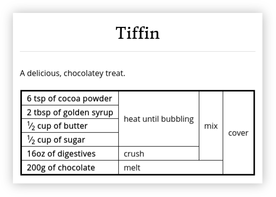

Recipe Grid (v2)
================

Recipe Grid is a collection of standalone utilities and also a Python library
for describing recipes in a tabular form, as illustrated by the following
(rather tasty) recipe below for tiffin:

These recipes have several advantages over traditional recipe descriptions:

* Recipes are typically more concise.
* Ingredients and method are shown together so no need to cross-reference
  between the two.
* Parts of the method are never "hidden" in an ingredients list (e.g. '1 onion,
  finely chopped')
* Opportunities to reorder steps or do them in parallel (or not!) are easy to
  spot while still providing a suggested order.

Recipes are described in Markdown files using a convenient to write recipe
description language. For example, the recipe above was generated from the
following Markdown:

.. code:: md

    Tiffin
    ======
    
    A delicious, chocolatey treat.
    
        6 tsp of cocoa powder
        2 tbsp of golden syrup
        1/2 cup of butter
        1/2 cup of sugar
        16oz of digestives
        200g of chocolate
        
        cover(
            mix(
                heat until bubbling (cocoa powder, golden syrup, butter, sugar),
                crush(digestives)
            ),
            melt(chocolate)
        )

Getting Started
---------------

You can install recipe grid from `PyPI
<https://pypi.org/project/recipe_grid/>`_ using::

    $ pip install recipe_grid

Then head over to `the tutorial
<https://mossblaser.github.io/recipe_grid/tutorial.html>`_ or jump straight
into the `main documentation <https://mossblaser.github.io/recipe_grid/>`_.

Development
-----------

Development dependencies, and an editable install can be setup using::

    $ pip install -e .
    $ pip install -r requirements-test.txt

Tests can be run using::

    $ pytest

Other pre-commit hooks can be run using::

    $ pre-commit run -a

And build the documentation using::

    $ pip install -r requirements-docs.txt
    $ make -C docs html

What about version 1?
---------------------

Recipe Grid 2 is a rewrite/reimagining of its predecessor which ended up being
one of those quick hacks which went on to live for a great many years. Recipe
Grid 2's recipe format is not quite backward compatible but is largely a
superset of the old format and upgrading existing recipes is not an arduous
task.

Recipe Grid 2 has many additional features while retaining a very similar
recipe description language. Key improvements include:

* More consistent recipe syntax and data model
* Recipes live within Markdown files
* Supports Directed Acyclic Graph (DAG) recipes; not just trees
* Can scale more than just ingredient quantities in a recipe
* Better error messages
* Fewer foot-guns
* Linter included to spot common errors
* Better HTML rendering
    * Improved readability
    * Includes mouseover unit conversions
    * Native serving counts and applied scaling more clearly indicated
* Better static sites
    * Links to alternative scaling of recipes
    * Browse without selecting a scale
    * Clearer navigation
    * Supports multiple levels of hierarchy
    * Supports custom messages on home and category pages
    * Much faster and more robust static site generator
* Extensive documentation
* Large test suite
* (Limited) Python API for parsing and inspecting recipes
